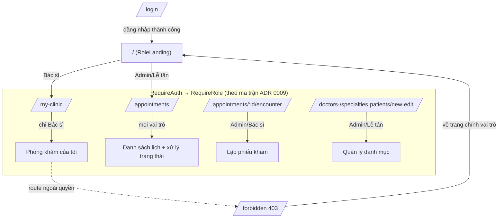

# Điều hướng & phân quyền giao diện theo vai trò

> Bổ trợ [ADR 0009](../adr/0009-phan-quyen-va-trai-nghiem-giao-dien-theo-vai-tro.md). Mô tả cách frontend cá nhân hoá trải nghiệm theo vai trò và ánh xạ với RBAC backend.

## Nguyên tắc: phòng thủ nhiều lớp
- **Backend là chốt chặn bảo mật** — mọi ghi sai quyền trả **403** (`Auth.Forbidden`), bất kể FE.
- **Frontend chỉ là lớp UX** — ẩn menu, redirect, guard route để người dùng chỉ thấy phần thuộc phận sự. Guard FE **không nới lỏng** RBAC BE.
- Nguồn sự thật quyền FE tập trung ở `frontend/src/config/access.ts` (helper `canManageStaff`/`canRecordEncounter`/`canManageCatalog`, `navItems`, `roleLandingPath`) — khớp hằng `Roles.ManageStaff`/`Roles.RecordEncounter`/`Roles.ManageCatalog` của backend.
- **Cập nhật Sprint 10:** danh mục master **Bác sĩ/Chuyên khoa** siết về **chỉ Admin** (ghi = `Roles.ManageCatalog`); Lễ tân không còn quản lý được. **Đọc** vẫn mở cho mọi vai trò (Lễ tân cần chọn bác sĩ khi đặt lịch).
- **Cập nhật ADR 0013:** thêm vai trò **Dược sĩ** quản lý trực tiếp **kho thuốc** (ghi = `Roles.ManagePharmacy = Admin + Dược sĩ`); Lễ tân/Bác sĩ **không** quản lý kho nữa. Chốt phiếu kèm cấp phát (`Roles.DispenseEncounter`) = Admin/Bác sĩ/Dược sĩ.
- **Cập nhật ADR 0016:** thêm vai trò **Kỹ thuật viên** thực hiện & **nhập kết quả CLS** (`Roles.RecordLabResult = Admin + Bác sĩ + Kỹ thuật viên`); lễ tân **đăng ký CLS** (`ManageStaff`) khi tạo lượt tiếp nhận (`VisitForm`) hoặc bổ sung ngay tại lượt đang mở (`VisitDetailPage`, thay cho màn `/lab/walk-in` đã gỡ). Cờ FE `canRecordLabResult` ở `config/access.ts`.

## Trang mặc định (landing) & menu theo vai trò

| Vai trò | Landing (`/`) | Menu hiển thị |
|---|---|---|
| Admin | `/appointments` | Lịch khám · Hàng đợi · Sinh hiệu · Bệnh nhân · Bác sĩ · Chuyên khoa · Phòng khám · Người dùng · Danh mục thuốc · Nhập kho · Cảnh báo kho · Đăng ký CLS · Thực hiện CLS · Hoá đơn · Bảng giá dịch vụ · Trợ lý |
| Lễ tân | `/appointments` | Lượt tiếp nhận · Lịch khám · Hàng đợi · Bệnh nhân · Phòng khám · Đăng ký CLS · Hoá đơn · Bảng giá dịch vụ · Trợ lý |
| Bác sĩ | `/my-clinic` | **Phòng khám của tôi** · Lịch khám · Bệnh nhân · Trợ lý |
| Dược sĩ | `/pharmacy/alerts` | Danh mục thuốc · Nhập kho · Cảnh báo kho · Trợ lý |
| Kỹ thuật viên | `/lab/technician` | **Thực hiện CLS** · Trợ lý |
| Điều dưỡng | `/queue` | **Hàng đợi** · Sinh hiệu · Trợ lý |

## Sơ đồ điều hướng

## Liên kết `User↔Doctor` & "của tôi"
- `Doctor.UserId?` (unique, nullable) gắn tài khoản đăng nhập với hồ sơ bác sĩ.
- `GET /api/auth/me` (và phản hồi login) trả `user.doctorId` bằng **tra cứu server-side** — tránh vấn đề token cũ thiếu claim.
- Màn **Phòng khám của tôi** gọi `GET /api/appointments?doctorId={doctorId}` rồi lọc trạng thái `CheckedIn`/`InProgress` phía client. Bác sĩ **chưa gắn hồ sơ** (`doctorId=null`) → hiển thị hướng dẫn nhờ Admin liên kết, không crash.

## Ghi chú seed (tài khoản demo)
Migration `AddDoctorUserLink` seed sẵn:
- Admin: `admin` / `Admin@123`.
- Bác sĩ: `bacsi` / `Doctor@123` — gắn hồ sơ `BS-000001` "Bác sĩ Demo" (chuyên khoa Nội tổng quát), dùng để thử luồng "Phòng khám của tôi".

Migration `SeedPharmacistUser` (ADR 0013) seed thêm:
- Dược sĩ: `duocsi` / `Pharmacist@123` — quản lý kho thuốc (danh mục, nhập kho, sổ cái, cảnh báo, cấp phát).

Migration `SeedTechnicianUser` (ADR 0016) seed thêm:
- Kỹ thuật viên: `kythuatvien` / `Technician@123` — thực hiện & nhập kết quả cận lâm sàng (`/lab/technician`).

Migration `SeedNurseUser` (ADR 0019) seed thêm:
- Điều dưỡng: `dieuduong` / `Nurse@123` — nhập sinh hiệu (`RecordVitals`) + điều phối hàng đợi (`ManageQueue`); không ghi bệnh án/đơn thuốc.
